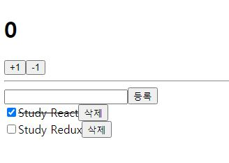

# React Redux Tutorial

> '리액트를 다루는 기술 - 김민준(Velopert)지음' 17장(리덕스를 사용하여 리액트 애플리케이션 상태 관리하기)을 학습하고 실습한 코드

## 실습결과

<p align="center">
  
</p>

## 학습내용

- redux 라이브러리
  - `combineReducers`
  - `createStore`
  - `bindActionCreators`
- react-redux 라이브러리
  - `<Provider>`
  - `connect`
- [Redux DevTool](https://chrome.google.com/webstore/detail/redux-devtools/lmhkpmbekcpmknklioeibfkpmmfibljd)을 이용하여 크롬 개발자 도구에서 Redux 상태 변화 확인하기
- redux-devtools-extension 패키지
  - `composeWithDevTools`
- redux-actions 라이브러리
  - `createAction`
  - `handleActions`

## 실행하기

```
$ yarn install
$ yarn start
```

## 참고

- [리액트를 다루는 기술 - 김민준 저](https://m.yes24.com/Goods/Detail/62597469)
